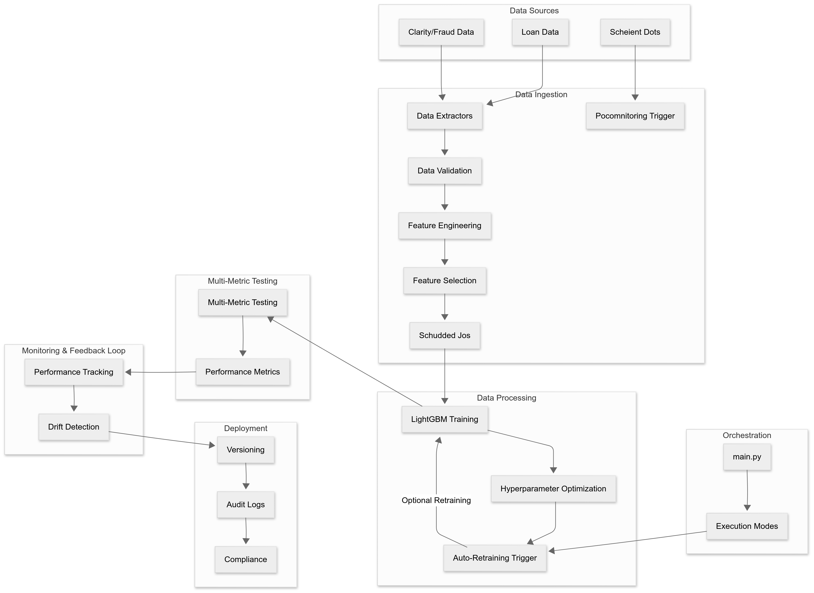

# MoneyLion Loan Risk Prediction System

This repository contains an automated machine learning system for predicting the risk of loan applications. The system handles data ingestion, preprocessing, model training, evaluation, deployment, and monitoring in an automated pipeline.



## Table of Contents

- [Prerequisites](#prerequisites)
- [Installation](#installation)
- [Project Structure](#project-structure)
- [Usage](#usage)
  - [Running the Pipeline](#running-the-pipeline)
  - [Using the Web Interface](#using-the-web-interface)
- [Pipeline Configuration](#pipeline-configuration)
- [Components](#components)
- [Data](#data)

## Prerequisites

- Python 3.9+
- pip (Python package installer)

## Installation

1. Create and activate a virtual environment (recommended):

   ```bash
   # Using Miniconda
   create -n loanrisk python=3.9 -y
   ```

2. Install the required packages:

   ```bash
   pip install -r requirements.txt
   ```

3. Create necessary directories for data:

   ```bash
   # Create data directory structure
   mkdir -p data/raw data/processed data/features models/production models/training models/evaluation
   ```

4. Place the input data files in the `data/raw` directory:
   - `loan.csv`
   - `payment.csv`
   - `clarity_underwriting_variables.csv`

## Project Structure

```
├── config/                 # Configuration files
│   └── pipeline_config.yaml # Main pipeline configuration
├── data/                   # Data directory
│   ├── raw/                # Raw input data
│   ├── processed/          # Processed data
│   └── features/           # Extracted features
├── image/                  # Images for documentation
│   └── architecture.png    # System architecture diagram
├── logs/                   # Log files
├── models/                 # Model storage
│   ├── training/           # Models in training
│   ├── evaluation/         # Model evaluation results
│   └── production/         # Production models
├── src/                    # Source code
│   ├── data.py             # Data ingestion and processing
│   ├── modeling.py         # Model training and evaluation
│   ├── deployment.py       # Model deployment
│   ├── monitoring.py       # Model monitoring
│   └── utils.py            # Utility functions
├── app.py                  # Streamlit web application
├── main.py                 # Main pipeline execution script
├── requirements.txt        # Project dependencies
└── README.md               # This file
```

## Usage

### Running the Pipeline

The ML pipeline can be run in different modes depending on your needs:

- **Full Pipeline**: Run all steps from data ingestion to model monitoring

  ```bash
  python main.py --config config/pipeline_config.yaml --mode full
  ```

- **Specific Steps**: Run individual pipeline components

  ```bash
  # Data ingestion only
  python main.py --config config/pipeline_config.yaml --mode ingest

  # Data processing only
  python main.py --config config/pipeline_config.yaml --mode process

  # Model training only
  python main.py --config config/pipeline_config.yaml --mode train

  # Model evaluation only
  python main.py --config config/pipeline_config.yaml --mode evaluate

  # Model deployment only
  python main.py --config config/pipeline_config.yaml --mode deploy

  # Model monitoring only
  python main.py --config config/pipeline_config.yaml --mode monitor
  ```

- **Forcing Deployment**: Deploy a model regardless of evaluation criteria
  ```bash
  python main.py --config config/pipeline_config.yaml --mode deploy --force-deploy
  ```

### Using the Web Interface

The system includes a Streamlit web application for interactive use:

```bash
streamlit run app.py
```

The web interface provides the following features:

- **Overview**: System description and information
- **Data Exploration**: Visualize and explore the loan data
- **Predict Risk**: Predict risk for new loan applications
- **Model Performance**: View current model metrics and performance
- **Run ML Pipeline**: Execute the automated ML pipeline components

## Pipeline Configuration

The pipeline is configured through the `config/pipeline_config.yaml` file. Major configuration sections include:

- **Data Sources**: Locations of input data files
- **Data Storage**: Directories for storing processed data
- **Feature Engineering**: Settings for feature creation and transformation
- **Model**: Model type and hyperparameters
- **Evaluation**: Metrics and thresholds for model evaluation
- **Deployment**: Criteria for deploying models to production
- **Monitoring**: Settings for monitoring model performance

Example configuration adjustment:

```yaml
model:
  type: "lightgbm"
  task: "regression"
  hyperparameters:
    n_estimators: 200
    learning_rate: 0.05
    # Adjust other parameters as needed
```

## Components

The system is built with the following main components:

1. **Data Ingestion**: Loads and validates raw data from various sources
2. **Data Processing**: Performs feature engineering and preprocessing
3. **Model Training**: Trains a LightGBM model for loan risk prediction
4. **Model Evaluation**: Assesses model performance with various metrics
5. **Model Deployment**: Deploys models to production when they meet quality criteria
6. **Model Monitoring**: Tracks model performance and detects drift

## Data

This system uses three main data files:

1. **loan.csv**: Loan application data including borrower information and loan status
2. **payment.csv**: Payment history data for loan repayments
3. **clarity_underwriting_variables.csv**: Fraud detection and underwriting variables

These files should be placed in the `data/raw` directory before running the pipeline.
